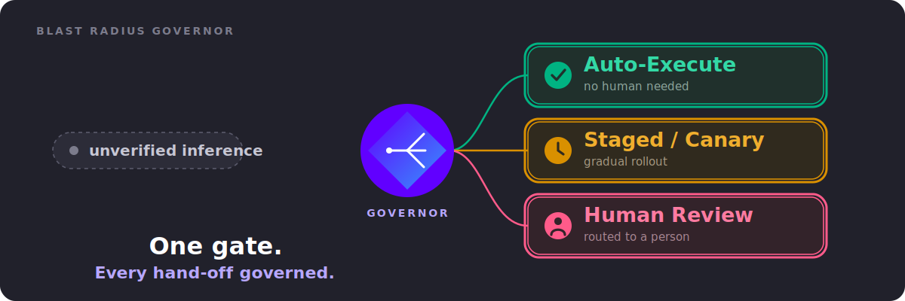

# Blast Radius Governor

**A governance agent for the hand-off between two AI agents.** NiCE's own 2026 *State of Agentic AI in CX* outlook names "governance agents" as the next stage of enterprise CX — and never defines what one does. This project scores every inter-agent hand-off on how much of it rests on verified fact versus inferred judgment, then routes it to auto-execute, a staged trial, or a human — proven across two unrelated domains with one unmodified engine.

## Why it matters, pillar by pillar

- **System Stability & Customer Resolution** (submitted pillar) — catches an unverified inference before it becomes an autonomous, hard-to-reverse action on a customer's account.
- **Cost Optimization** — runs on one of the cheapest models on Bedrock, drops into an existing pipeline with no rebuild, pilotable in days.
- **Operational Efficiency** — auto-executes the hand-offs that are actually safe, so only the genuinely risky fraction ever reaches a human queue.
- **Product Innovation** — a first working answer to a role NiCE's own materials name as coming but leave undefined.
- **Product Modernization** — gives any existing agent pipeline a drop-in oversight layer without redesigning it for the agentic era.

## Start here

Read **`docs/REQUIREMENTS.md`** — short by design: goals, requirements, acceptance criteria, and a map to the 4 implementation stories in `docs/stories/`. Presentation materials (video script, deck talking points) live in `docs/presentation/`.

Built solo with an AI coding agent. Deliverables: video walkthrough + slide deck, no live pitch.
